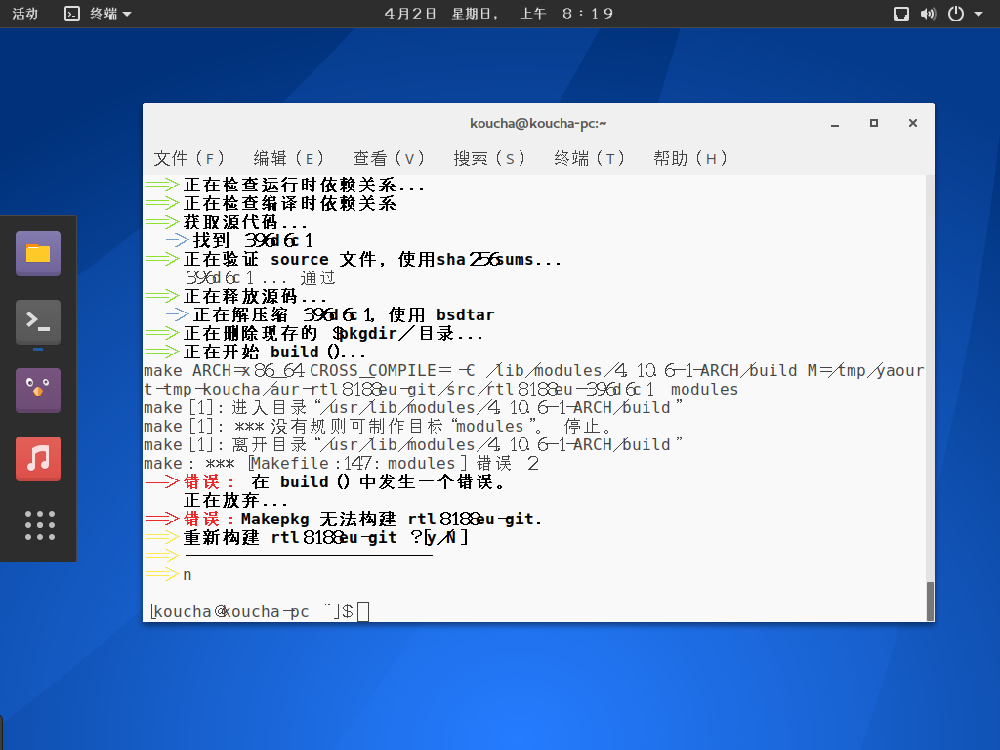

嘛,这不算是我第一次见到这种字体效果了,但是我还是被吓到了.从第一次安装linux的时候我就在怀疑这种效果是故意的还是因为实在是没啥中文使用者在开发[大概很明显是后者].

## 正常的处理方法
实际上并不算是处理,都是存在配置工具的.稍微调整就可以达到挺不错的效果了.搜索tweaktool就可以.

## 吐槽
神他喵的为什么不学学ubuntu那边直接用文泉驿当默认字体啊!
不用正常的中文字体就算了,神他喵的终端里还不是等宽字体!
用正常的字体和等宽也就算了,某发行版中文环境默认配置还是宋体,EXM???喵喵喵!?宋体?[某mint]

----------
给我来瓶冰阔落？

