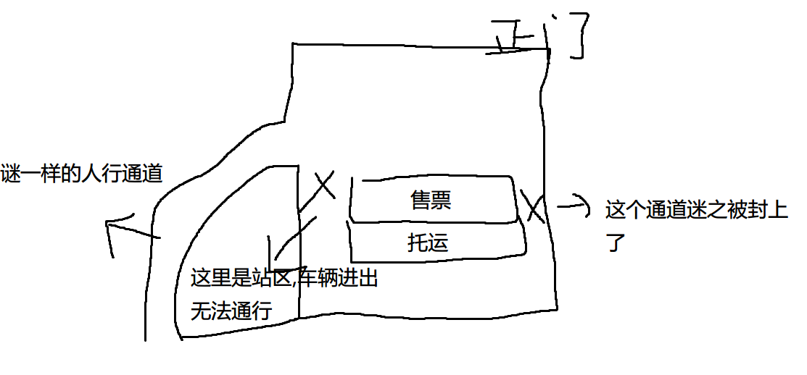

6-18号当天,我参加了第一次的骑行比赛[骑闯天路桃花岛资格赛].

前一个月的时候我和表弟决定参加这个比赛.我们考虑了一下比赛能否完成.最后得出的结论是:完成应该还是可以的.

到了16号当天,我坐了一班晚点一小时的动车到了宁波.而这才是我这几天懵逼的开始.

实际上我那天晚上没有睡着...因为休学在家,作息一直是晚上工作,所以17号早上七点半我就把表弟叫醒,吃了个饭去找自行车店了.第二个懵逼的事情发生了,那就是没看车店营业时间,到了车店发现大门紧闭,而我们只剩下20分钟时间回程赶车.回程后,我们收拾行装退房去了汽车站.

最懵逼的事情发生了.汽车站的内部结构异常感人,我们绕了一圈才到售票处,在售票处问了咨询台托运在哪里,咨询台说在售票处后面,那么问题来了...这个后面是个什么情况我觉得有必要画个简单的示意图:

更重点的是这个人行通道是不让自行车通过的= -,这就很懵逼了.为什么我可以从正门进车站,进了车站也从这个地方出来了,却不能让我再从这个地方进去?What The Fuck?折腾了两圈以后我已经有些脱力,于是花钱让工作人员帮忙买票在托运处处理完了事情.

然后神奇的事情又发生在了下船登岛的时候,我的右手拇指被自行车给夹出血了.

在岛上,我们下午的时候爬了一段坡,于是发现我的车胎有些漏气.

比赛当天则是我最懵逼的时刻了.

刚骑出去2.7公里,我撞在了护栏上.那个时候我只感觉到突然控制不住车,转向失效,等我控制住以后我就来不及过弯了,我就挂在了护栏上.

最后我以龟速骑完了一圈直接回程了.

感觉自己和桃花岛命里相克.GGWP,等下个能完成的比赛吧.

----------
给我来瓶冰阔落？

