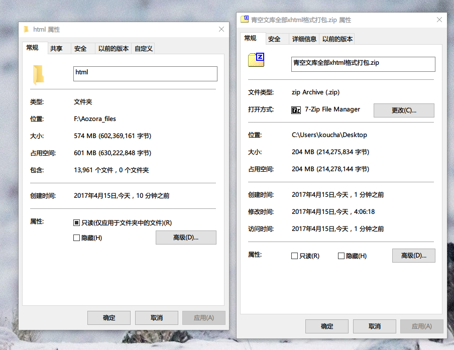

搜索了一阵子有没有打包好的html文件,结果并没有,于是使用了
```
wget -c -r -np -k -L -p http://www.aozora.gr.jp
```

下载了青空文库全站

之后又使用:

```python
# coding =UTF-8
'''
from Koucha on 2017-4-15
'''
import sys
import os
import shutil
import re


def sourcecpy(src, des):
    src = os.path.normpath(src)
    des = os.path.normpath(des)
    if not os.path.exists(src) or not os.path.exists(src):
        print("文件路径不存在")
        sys.exit(1)

    os.chdir(src)
    src_file = [os.path.join(src, file) for file in os.listdir()]
    for source in src_file:
        if os.path.isfile(source):
            shutil.copy(source, des)
        if os.path.isdir(source):
            p, src_name = os.path.split(source)
            des = os.path.join(des, src_name)
            shutil.copytree(source, des)


os.chdir(r'F:\Bak_Aozora\Aozora')

oldout = sys.stdout
sys.stdout = open(r'C:\Users\koucha\Desktop\JP_Learner\log.txt', 'w+')


what = os.walk(r'F:\Bak_Aozora\Aozora')
filespathlist = []
for i in what:
    if re.search('files$', i[0]) is not None:
        filespathlist.append(i[0])
print(filespathlist)

for eachpath in filespathlist:
    sourcecpy(eachpath, r'F:\files\files')
sys.stdout.close()
sys.stdout = oldout
print('ok')
```
提取了所有的files文件夹下的文件,再单独把html的文件复制了一份压缩上传.之后可能会分类吧....不过并不打算上传分类好的文件.

----------
给我来瓶冰阔落？

